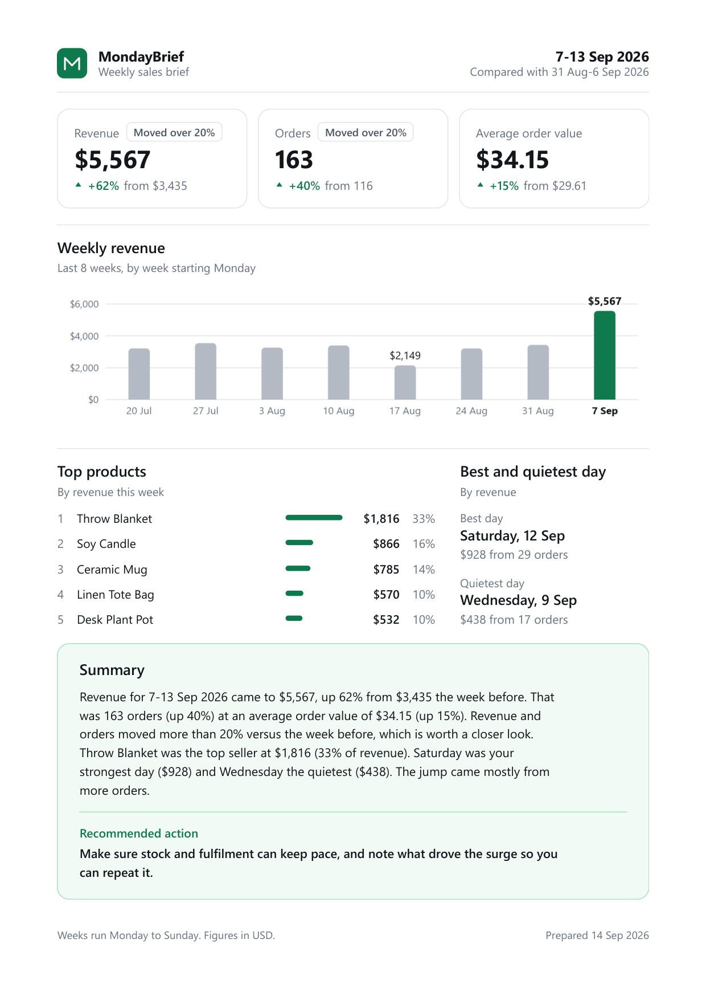

# MondayBrief

An automated weekly sales report for small online stores. It reads your sales data, works out
how the week went, and writes a one-page branded PDF with a plain-English summary and one
recommended action. It runs itself every Monday morning on GitHub Actions and commits the PDF
to this repository.

Built for owners who rebuild the same report by hand every week.



**[Open the sample report (PDF)](docs/sample-report.pdf)**, built from the bundled sample data.

## What the report contains

- Revenue this week against last week, with the week-over-week change
- Order count and average order value, each compared with the week before
- The top 5 products by revenue
- The best and quietest day of the week
- A revenue chart for the last 8 weeks
- A flag on any figure that moved more than 20% either way
- A short summary paragraph and one recommended action, chosen from what the numbers say
  (a demand problem reads differently from a shrinking basket, and a surge differently from a slip)

## How it works

```
Google Sheet (published CSV)   or   data/sample_sales.csv
              |
   src/load_data.py     reads the data, checks the columns, cleans the values
   src/analyze.py       weekly numbers, anomaly flags, summary text
   src/chart.py         the 8-week chart (matplotlib, inlined as a base64 PNG)
   src/render_pdf.py    fills templates/report.html and prints it to A4 with Chromium
              |
       reports/YYYY-MM-DD.pdf     committed by the workflow
```

Your data needs one row per order with four columns (capitalisation and extra spaces in the
headers don't matter, and extra columns are ignored):

| Date       | Product     | Region | Amount |
|------------|-------------|--------|--------|
| 2026-09-12 | Soy Candle  | UK     | 36.00  |

Weeks run Monday to Sunday. The brief covers the latest week in the data and compares it with
the week before.

## The schedule

The workflow in [`.github/workflows/weekly-report.yml`](.github/workflows/weekly-report.yml)
runs every **Monday at 09:00 UTC** (GitHub schedules are always in UTC). Each run:

1. installs Python, the dependencies and Chromium
2. loads the data and builds the report
3. saves it as `reports/YYYY-MM-DD.pdf`, dated with the day it ran
4. commits and pushes the PDF

You can also run it any time from the **Actions** tab: choose **Weekly report**, then **Run
workflow**. The optional `week` box takes any date (`2026-08-19`) and reports on the
Monday-to-Sunday week that contains it.

Good to know:

- **Until you set your own data source, it reports on the bundled sample data.** Every run
  produces the same figures (the week of 7 to 13 September 2026), and only the date changes.
  That is enough to see the automation working. See the next section to use real data.
- **A failed run commits nothing.** If the data can't be read or the sheet link stops working,
  the run turns red and the log says what to fix. It never quietly falls back to sample data.
- **The workflow needs permission to push.** It asks for `contents: write`. If the push step
  fails, check Settings > Actions > General > Workflow permissions.
- **GitHub can pause scheduled workflows** in a public repository after 60 days without
  activity. If Monday's report goes missing, open the Actions tab and re-enable it.
- **Scheduled runs can start a few minutes late** when GitHub is busy.
- **Committed reports are as public as the repository.** If the data is real, use a private
  repository.

## Point it at your own Google Sheet

1. Put your orders in a sheet with a header row of `Date`, `Product`, `Region`, `Amount`.
2. In Google Sheets choose **File > Share > Publish to web**. Pick the tab, choose
   **Comma-separated values (.csv)**, click **Publish**, and copy the link. It looks like
   `https://docs.google.com/spreadsheets/d/e/.../pub?output=csv`.
3. In your GitHub repository go to **Settings > Secrets and variables > Actions > Variables**
   and add a repository variable named `SALES_DATA_URL` with that link.
4. Run the workflow once from the Actions tab to check it.

To try it on your own machine first:

```powershell
$env:SALES_DATA_URL = "https://docs.google.com/spreadsheets/d/e/.../pub?output=csv"
python -m src.render_pdf
```

On macOS or Linux use `export SALES_DATA_URL="..."`.

A published link can be opened by anyone who has it, which is why it is stored as a variable
rather than a secret. Don't publish a sheet that holds anything you wouldn't share by link.
No Google account access, OAuth or service-account file is used.

If something is wrong you get a plain message, for example
`Missing required column(s): Amount. Found: Date, Product, Total.` or a list of the rows with
a bad date or amount, using the row numbers you see in the sheet. If the link returns a web
page instead of CSV, the sheet isn't published yet.

## Enable email (optional, off by default)

The project needs no credentials to run, and email is switched off. The code is there for when
you want it: [`src/send_report.py`](src/send_report.py) sends the PDF through an email service
that works like [Resend](https://resend.com) (an HTTPS API with a Bearer API key). Nothing
else in the project calls it.

**1. Get an API key.** Create an account with the provider, verify the domain you will send
from, and create an API key. Check the provider's own rules for which sender addresses are
allowed.

**2. Try it without sending anything.** A dry run needs no key and no network:

```powershell
$env:MAIL_FROM = "briefs@yourdomain.com"
python -m src.send_report docs/sample-report.pdf --to you@example.com --dry-run
```

It prints the message it would send, with the attachment shown as a size.

**3. Add the settings to GitHub** (Settings > Secrets and variables > Actions):

| Name             | Kind     | Value                                              |
|------------------|----------|----------------------------------------------------|
| `RESEND_API_KEY` | Secret   | the API key                                        |
| `MAIL_FROM`      | Variable | the sender, on your verified domain                |
| `MAIL_TO`        | Variable | one or more recipients, separated by commas        |

**4. Turn the step on.** In `.github/workflows/weekly-report.yml`, find the step named
**Email the report (disabled)** and change `if: ${{ false }}` to `if: ${{ true }}`.

**5. Run the workflow** from the Actions tab and check your inbox.

From Python, with a brief so the subject and body come from the report:

```python
from src.send_report import send_report

send_report("reports/2026-09-14.pdf", to="you@example.com", brief=brief)
```

Safety notes:

- The API key is read only from the `RESEND_API_KEY` environment variable. Never put it in a
  file, and never commit it. `.env` files are already in `.gitignore`.
- The key is never printed, and it is only ever sent to an `https://` address.
- To use a different provider with the same request shape, pass its address as `api_url`.

## Run it locally

You need Python 3.11 or newer.

```powershell
git clone https://github.com/<your-username>/<this-repo>.git
cd <this-repo>

python -m venv .venv
.\.venv\Scripts\Activate.ps1
pip install -r requirements.txt
python -m playwright install chromium

python -m src.render_pdf
```

That writes `output/weekly_brief_2026-09-13.pdf` from the sample data. On macOS or Linux,
activate the environment with `source .venv/bin/activate`, and install Chromium with
`python -m playwright install --with-deps chromium`.

Each stage can also be run on its own:

```powershell
python -m src.load_data                     # load and validate the data
python -m src.analyze                       # print the brief as JSON, then the summary
python -m src.analyze --week 2026-08-19     # any date in the week you want
python -m src.chart                         # preview the chart as a PNG
python -m src.render_pdf --week 2026-08-19 --out my-report.pdf
python -m src.render_pdf --source path\to\your.csv
python scripts/generate_sample_data.py      # rebuild data/sample_sales.csv
```

To rebuild the README's sample report and screenshot, run `pip install -r requirements-dev.txt`
and then `python scripts/make_docs_assets.py`.

## Project layout

```
.github/workflows/weekly-report.yml   the Monday schedule
src/
  load_data.py                        read and validate the data
  analyze.py                          weekly numbers, flags, summary
  chart.py                            the 8-week chart
  render_pdf.py                       template to A4 PDF
  send_report.py                      optional email (off by default)
templates/report.html                 the report design
data/sample_sales.csv                 8 weeks of sample orders
reports/                              the weekly PDFs land here
docs/                                 the README's sample report and screenshot
scripts/                              sample-data and README asset builders
```

## Design notes

The report uses the system font stack, so it needs no font downloads. Machines differ in which
font they pick (Segoe UI on Windows, a Liberation or DejaVu sans on a Linux runner), so the PDFs
from Actions can look slightly different from ones made locally. The layout measures itself
before printing and tightens its spacing when a wider font or a longer summary would push it
onto a second page, so the report stays on one A4 page.

## Out of scope

A web interface, a database, Google sign-in, more than one template, Slack delivery and
multiple stores are deliberately not part of this project.
